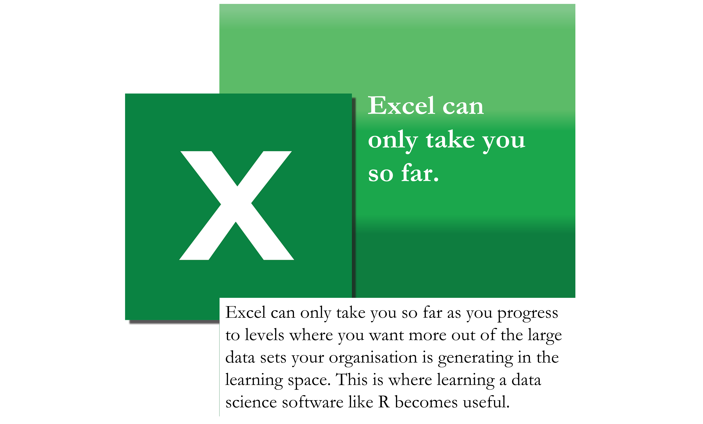
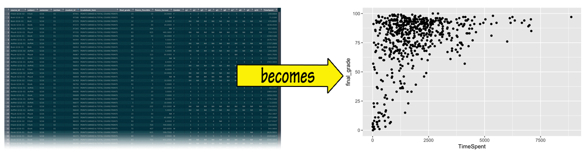
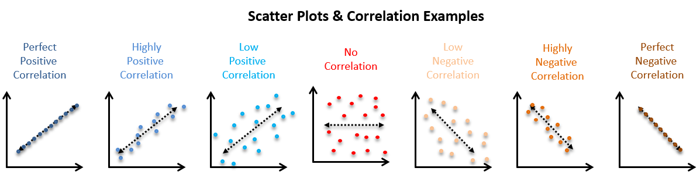
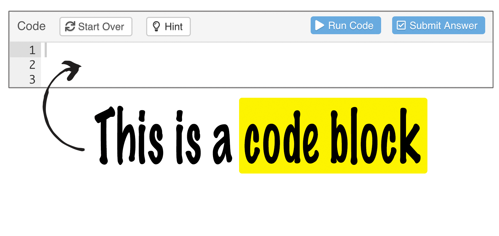
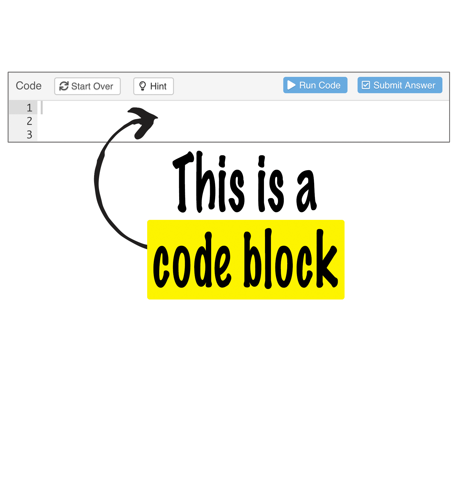

```{=html}
<!-- Include the following chunk even if you don't understand
all the details. It attaches packages we need, loads the course data, 
binds them to the variable dat, and does a tiny bit of data cleaning -->
```
```{r setup, include=FALSE}

# load packages
library(learnr)
library(tidyverse)

# options
knitr::opts_chunk$set(echo = FALSE)

# code checking
checker <- function(label, user_code, check_code, envir_result, evaluate_result, ...) {list(message = check_code, correct = TRUE, location = "append")
}
tutorial_options(exercise.timelimit = 10,
exercise.checker = checker)

# setup everything that exercise chunks need to know about here
# course data are defined in variable dat
load('data/course1_data.rda')
dat <- select(dat, -Grade_Category) # drop column with only NAs
dat$final_grade <- round(dat$final_grade, 0)  # Round final grades 
# Gradebook data are defined in variable classwork_df
load('data/gradebook.rda')
```

## How You Will Benefit

{width="90%"}

{width="90%"}

```{r quiz}
quiz(
  question("Why should educators learn data science?",
    answer("You can ask your own questions of the data", message = "Data science allows you to ask questions that the original analyse may not have.", correct = TRUE),
    answer("You can focus on only the data that is relevant to you", message = "Data science enables you to customise the data set to focus on only on data relevant to your specific area", correct = TRUE),
    answer("You can use this knowledge to explore data that you have collected yourself", message = "With a little more training you can use data science skills on data that you collect", correct = TRUE),
    answer("Data science may help you to become a more informed educator", message = "Data science skills provide educators another way to gain knowledge, and we all know that knowledge empowers us all.", correct = TRUE),
    try_again_button = "Try Again",
    try_again = "Yes, good job. You have identified some of the benefits. However,  educators can find using data science benefifical in even more ways.",
    allow_retry = TRUE
  )
)
```

## Why R?

Visualisation is one of the most important tools for data science.

</p>

R is purpose built to make visual sense of data because...

{width="90%"}

{width="80%"}

### What makes R so great?

-   It's open source and has a large community using it and helping
    users for free.
-   You can create stunning visualisations from your dataset.
-   You can create complex statistical models from just a few lines of
    code.
-   Learning the important skills of data science can actually be very
    easy once you get past the R fundamentals.
-   It has many sub-programs called packages that are designed to make
    your life easier as you try to do different things with data.
-   ggplot2 is one such package, its focus is visualising data using R.

## What You Will Learn

In this tutorial, you'll learn how to visualise data sets using the ggplot2 package
in R.

You will turn your data into graphs, so that... 
{width="100%"}

</p>
Graphs such as this scatterplot, make interpreting trends in your data
easier.</br> They display the relationship between two continuous
variables.

</p>

The closer the data points come to forming a straight line, the higher the correlation between the two variables or the stronger the relationship.
</p>

{width="100%"}

As you progress with the exercises, you'll begin to pick up on the
fundamentals of R.

In the next section, we'll derive a hypothesis and meet the data set
you'll use to test it.

## Start With Your Hypothesis

You're tasked with evaluating the effectiveness of digital learning
design at your institution that's made a significant investment in a learning management system (LMS) over the past 2 years. You've collected different data sets and are now ready to start your exploratory analysis.

You decide to start a data set called `dat` about Uni courses.

### Watch this video to meet `dat`


You've decided to look at time spent vs grades to see if there is a
trend that could fuel more insights into design quality and LMS use.

What do you think?

-   More time spent on the LMS improves grades.
-   More time spent on the LMS lowers grades.

## Apply the ggplot2 Workflow

To test your theory, you'll use ggplot2, the R package that helps
you create data visualisations. </br>
You'll use a code template and a common workflow to make graphs in ggplot2, as below:

1.  Call and view your data set in the R environment.
2.  Create an empty graph.
3.  Add layers to the graph in the form of axes and dot points.

We'll perform these steps next using code blocks as the 'stage' to execute commands.


## Test Your Hypothesis

### First, a word about code blocks

Constructing scatterplots in R is different from base graphics packages
such as Excel; ggplot2 outputs graphs using code blocks. </p>
All the data needed to make a graph is typically contained within the `ggplot()` function and R visualises this through the commands you enter into code blocks.

{width="85%"}

### Now call and view your data

Before we start creating graphs let's output `dat` as a data frame using the code block below.

1.  Type `dat`

2.  Click `Run Code`

3.  Click `Submit Answer` 

```{r data, exercise=TRUE}
#This is the code block. Type dat on line below.
```

```{r data-solution}
dat
```

```{r data-check}
"The table shows the first 10 rows. Note that you need to click the arrow (top right) to see additional columns, and click the numbers (bottom right) to see more rows."

```

<details>
<summary> To isolate variables in the data frame, click here to expand! </summary>
<br>
**Isolating variables in the data frame**

We can isolate variables (columns) in the data frame:

1.  Click “Run Code” to run the command lines in the code block below

2.  Click "Submit Answer"

```{r data-distinct, exercise=TRUE}
distinct(dat, final_grade, TimeSpent)
```

```{r data-distinct-solution}
Click Run Code
```

```{r data-distinct-check}
"Nice one! This code has isolated just the final_grade and the TimeSpent variables in the data frame."
```

</details>
</details>

### Create an Empty Graph

The `ggplot()` function is used to visualise data from data frames. The data frame you'll use to generate the `ggplot()` is the `dat` data set.

So, you will combine the function `ggplot()` and the argument `data = dat` to add `ggplot(data = dat)` to the code block below to generate an empty graph:

```#r
ggplot (data = dat)

```


```{r blank, exercise=TRUE}
ggplot(data = dat)

```


A blank graph is drawn, but there are no points or lines in it.

This is because, the `ggplot()` function doesn't assume that you meant a scatterplot should be generated. You have only told it which data set to use by adding `data = dat` within the brackets,</br> 
BUT you haven't told it which columns to use for the X and Y axes, </br>
AND you haven't explicitly asked it to draw any points.

We'll use the next step to specify a graph type and assign variables to the X and Y axes.

### Plot Your Variables

**`geom_point()`** adds a layer of points to the empty plot.

`geom_point()` takes a **mapping** argument that defines which variables
in your dataset are mapped to which axes in your graph. The mapping
argument is always paired with the function aes(), which you use to
gather together all of the variables that you want to create.

Here, we want to map the `TimeSpent` variable to the x axis and the
`final_grade` variable to the y axis, so we add `x = TimeSpent` and
`y = final_grade` inside of `aes()` (and we separate them with a comma).

In order to run R codes in this tutorial, you just click on `Run Code`
button on the right top.

```{r exercise3x, exercise=TRUE}
ggplot(data = dat) +
 geom_point(mapping = aes(x = TimeSpent, y = final_grade))

```

And that's your data in a scatterplot visualisation!


```{r quiz-extra}
quiz(
    question("What does the data indicate to you?",
    answer("Negative correlation between grades and time spent", message = "A negative correlation means that as one variable goes up, the other goes down."),
    answer("Positive correlation between grades and time spent", correct = TRUE, message = "A positive correlation means that both variables move in the same direction. In this case, when students spend more time studying, the final score is likely to be better "),
    try_again = " You can imagine a line going through a scatter plot of data points that best expresses the relationship between those points.",
    allow_retry = TRUE
  
)
)
```


## Add a Third Variable

What if you'd like to see if there is a difference in the way male and
female students perform with regard to time spent? You could simply add
that variable `color = Gender` to your plot.

So, we add `color = Gender` inside of `aes()` beside available mapping
`x = TimeSpent` and `y = final_grade` (and we continue to separate them
with a comma).

Notes: You must use exact name set up in the data set. Be Careful with
upper-case and lower-case.

```{r addx, exercise=TRUE}
ggplot(data = dat) + 
  geom_point(mapping = aes(x = TimeSpent, y = final_grade))

```

```{r addx-hint}
ggplot(data = dat) + 
  geom_point(mapping = aes(x = TimeSpent, y = final_grade, color = Gender))

```

```{r addx-check}
"Awesome! You've realized that R code is case-sensitive"
```

Red = Females Blue = Males

What can you infer from the new dimension to this visualisation?

```{r quiz-visualisation}
quiz(
    question("The Time Spent versus Final Grade scatterplot above suggests that:",
    answer("Time spent has a very large effect on final grade", message = "Time Spent did have an effect but most of the points are clustered <2500."),
    answer("There was a low average grade overall", message = "Are most of the points clustered at the top or bottom?"),
    answer("There were more females than males taking courses", correct = TRUE),
    answer("Time spent had some effect on final grade for some students", correct = TRUE),
    try_again = "You need two answers for this question!",
    allow_retry = TRUE
  )
)
```


You can keep enhancing the plot by adding more layers (and themes) to an
existing plot created using the ggplot() function.

### Summarising the workflow

We followed the common workflow for making graphs with ggplot2. To make
a graph, you:

1.  Start the graph with `ggplot()`
2.  Add elements to the graph with a `geom_` function
3.  Select variables with the `mapping = aes()` argument

``` #{r}
ggplot(data = <DATA>) + 
  geom_FUNCTION(mapping = aes(<MAPPINGS>))
```


## Scatterplot Playground

Now that you know the workflow, use this environment to play around with
ggplot2!

Use this code template:</br>
`ggplot(data = dat) +`  `geom_point(mapping = aes(x = variable, y = variable, optional aesthetic))`
</br>

Then mix and match variables and asthetics:</br>
P.S. "variables" include: `TimeSpent`, `Gender`, `final_grade`, `subject`, and `semester`. </br>
"optional aesthetics" can be: `color = variable`, `shape = variable`, `size = variable`, and `alpha = variable`

```{r exercise99, exercise=TRUE}

```

Next, head to the Common Problems section to refine your understanding and the Explore More Graphs section to apply your learning.


## Common Problems - Help

### Problems with code

We designed exercises to help you recognise common problems in R syntax.

1. See errors in the available codes by clicking `Run Code`

2. Fix these errors then click `Submit Answer` to see a custom message!

**Missing characters**

```{r problem1, exercise=TRUE}
ggplot(data = dat) + 
  geom_point(mapping = aes(x = TimeSpent, y = final_grade)

```

```{r problem1-hint}
Make sure that every `(` is matched with a `)`
```

```{r problem1-check}
"Congratulations! You've recognized the lack of `)`. R is extremely picky, and a lack character can make all the difference. Make sure that every `(` is matched with a `)`; `"`is paired with another `"`."

```

**Capitalization error**

```{r problem2, exercise=TRUE}
ggplot(data = dat) + 
  geom_point(mapping = aes(x = TimeSpent, y = final_grade, color = gender))

```

```{r problem2-hint}
Which is the right name of variable "gender": `gender` or `Gender`?
```

```{r problem2-check}
"Great job! You've recognized the wrong character. You should start by carefully comparing the code that you’re running to the code in the examples. Please pay attention to capitalization because R is case sensitive."

```

**Misplaced character "+"**

```{r problem3, exercise=TRUE}
ggplot(data = dat)
+ geom_point(mapping = aes(x = TimeSpent, y = final_grade))

```

```{r problem3-hint}
the `+` is put at the wrong place: it has to come at the end of a line, not the start
```

```{r problem3-check}
"Excellent! You've recognized  `+` is in the wrong location. One common problem when creating ggplot2 graphics is to put the `+` in the wrong place: it has to come at the end of a line, not the start."

```

### Help

<details>

<summary>If you're still stuck, click ***here*** for further **Help**</summary>

<p>

You can get help about any R function by running `?function_name` in a
code chunk, e.g. `?geom_point`. Don't worry if the help doesn't seem
that helpful --- instead skip down to the bottom of the help page and
look for a code example that matches what you're trying to do.

If that doesn't help, carefully read the error message that appears when
you run your (non-working) code. Sometimes the answer will be buried
there! But when you're new to R, you might not yet know how to
understand the error message. Another great tool is Google: try googling
the error message, as it's likely someone else has had the same problem,
and has gotten help online.


### How to use code blocks 

{width="85%"}


## Explore More Graphs

You're now going to start using code blocks to output scatterplots and other graph types using `dat`.


**Make a boxplot**

In fact, you can turn our code into a reusable template for making
graphs. To make a graph, replace the bracketed sections in the code
below with a data set, a `geom_` function, or a collection of mappings.

Give it a try! Replace the bracketed sections with `dat`,
`geom_boxplot`, and `x = semester, y = final_grade` to make a slightly
different graph.

You can use `Solution` button to help you find out the answer. Then,
click `Submit Answer` to check your answer.

```{r boxplotx, exercise=TRUE, exercise.lines = 7}

```

```{r boxplotx-solution}
ggplot(data = dat) + 
  geom_boxplot(mapping = aes(x = semester, y = final_grade))
```

```{r boxplotx-check}
"Good job! This plot uses boxplots to compare the learning outcome (final_grade) of different semesters. ggplot2 comes with many geom functions that each add a different type of layer to a plot. You'll learn more about boxplots and other geoms in the tutorials that follow!"
```


**Make a scatterplot with one discrete/categorical variable**

Try to make a scatterplot of `subject` vs `final_grade`

```{r exercise3, exercise=TRUE}
ggplot(data = dat) +
 geom_point(mapping = aes(x = subject, y = final_grade))

```

```{r exercise3-hint}
change `geom_point` to `geom_boxplot` for better relationship display.
```

```{r exercise3-check}
"Well done! One useful way to explore the relationship between a continuous and a categorical variable is with a set of side by side box plots, one for each of the categories. Similarities and differences between the category levels can be seen in the length and position of the boxes and whiskers."

```

**Make a scatterplot with two discrete/categorical variable**

What happens if you make a scatterplot of `semester` vs `subject`. Try
it. Why is the plot not useful?

```{r exercise4, exercise=TRUE}

```

```{r exercise4-check}
"Nice job! `semester` and `subject` are both categorical variables. As a result, points can only appear at certain values, where many points overlap each other. You have no idea how many points fall on top of each other at each location. Experiment with geom_count() to find a better solution."
```

### Test yourself

Some questions to verify that you understand one of the most popular
types of data visualization - the scatter plot:

```{r quiz-2}
quiz(
    question("Looking at the graphs, scatterplots are best used for visualising:",
    answer("Two continuous variables", correct = TRUE),
    answer("Dots that each report the values of a data point", correct = TRUE),
    answer("Two categorical variables", message = "Compare the usefulness of the information in the graphs you made for continuous and categorical variables"),
    answer("Quartiles to demonstrate spread of data", message = "Quartiles are usually represented by boxes and lines."),
    try_again_button = "Try Again",
    try_again = "There may be more than one answer!",
    allow_retry = TRUE
  )
)
```


## Up Next

In future tutorials we will continue to explore the course_data and
introduce the Gradebook data below. Stay tuned ...

### Gradebook data

A dataset with typical school gradebook entries.

```{r show_data2, exercise = TRUE}
# Show the value of the variable classwork_df by handing the variable to the 
# R interpreter. 
classwork_df
```
